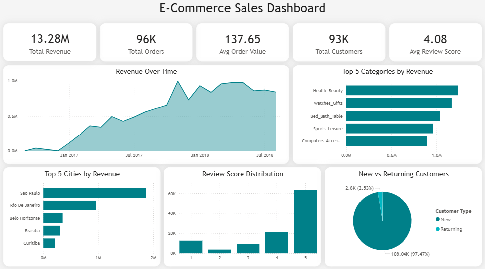

## 📊 Project Overview

Interactive Power BI dashboard analyzing Brazilian e-commerce sales data to track revenue trends, customer behavior, and satisfaction metrics. The analysis processes 99K orders across 2 years using SQL for data transformation and Power BI for visualization, revealing critical insights including a 2.5% customer retention rate and identifying key growth opportunities.

---

## 🎯 Business Objectives

- Track revenue growth and identify seasonal trends
- Identify top-performing product categories and regions
- Analyze customer retention rates
- Monitor customer satisfaction through review scores
- Understand delivery time impact on satisfaction

---

## 📁 Data Source

**Dataset:** [Brazilian E-Commerce Public Dataset by Olist](https://www.kaggle.com/datasets/olistbr/brazilian-ecommerce)  
**Period:** September 2016 - August 2018  
**Total Records:** 99,441 delivered orders

### Selected Tables for Analysis

From the full dataset (9 tables), I selected these 6 for the analysis:

- `olist_orders_dataset.csv` - Order details and timestamps
- `olist_customers_dataset.csv` - Customer demographics and location
- `olist_order_items_dataset.csv` - Product-level order details
- `olist_products_dataset.csv` - Product information
- `olist_order_reviews_dataset.csv` - Customer ratings and reviews
- `product_category_name_translation.csv` - Portuguese to English translations

---

## 🔄 Data Processing

### SQL Transformation

Created a consolidated analytical dataset by joining the selected tables:

```sql
-- Create database
CREATE DATABASE ecommerce_sales_analysis;
USE ecommerce_sales_analysis;

-- Join delivered order data across key tables
SELECT 
    o.order_id,
    o.order_purchase_timestamp,
    o.order_delivered_customer_date,
    c.customer_unique_id,
    c.customer_city,
    c.customer_state,
    oi.product_id,
    oi.price,
    oi.freight_value,
    p.product_category_name,
    t.product_category_name_english,
    r.review_score
INTO dbo.sales_analysis
FROM dbo.olist_orders_dataset o
INNER JOIN dbo.olist_customers_dataset c 
    ON o.customer_id = c.customer_id
INNER JOIN dbo.olist_order_items_dataset oi 
    ON o.order_id = oi.order_id
INNER JOIN dbo.olist_products_dataset p 
    ON oi.product_id = p.product_id
LEFT JOIN dbo.product_category_name_translation t 
    ON p.product_category_name = t.product_category_name
LEFT JOIN dbo.olist_order_reviews_dataset r 
    ON o.order_id = r.order_id
WHERE o.order_status = 'delivered';
```

**Key Transformations:**
- Combined 6 source tables using INNER/LEFT JOINs
- Filtered for delivered orders only
- Translated Portuguese categories to English
- Cleaned and renamed columns in Power Query
- Created Customer Type classification (New vs Returning)

---

## 📈 Dashboard Metrics

### Key Performance Indicators

| KPI | Value | Insight |
|-----|-------|---------|
| **Total Revenue** | R$ 13.28M | Strong performance across period |
| **Total Orders** | 96K | High transaction volume |
| **Avg Order Value** | R$ 137.65 | Healthy basket size |
| **Total Customers** | 93K | Large customer base |
| **Avg Review Score** | 4.08/5.0 | High satisfaction rate |

### Visualizations

1. **Revenue Over Time** - Monthly trend showing growth pattern and seasonality
2. **Top 5 Categories by Revenue** - Health & Beauty leads sales
3. **Top 5 Cities by Revenue** - São Paulo and Rio dominate
4. **Review Score Distribution** - Majority 5-star ratings (60K+)
5. **New vs Returning Customers** - 97.5% new, 2.5% returning

---

## 💡 Key Insights

### Revenue & Growth
✅ Consistent revenue growth from Sep 2016 to Aug 2018  
✅ Peak sales period: Q4 2017 - Q1 2018 (holiday season)  
✅ Health & Beauty category drives highest revenue

### Customer Behavior
⚠️ **Critical Finding:** Only 2.5% customer retention rate  
✅ High satisfaction (4.08/5.0 avg review score)  
📍 Sales concentrated in São Paulo and Rio de Janeiro

### Business Recommendations
1. **Implement loyalty program** - Address low retention (2.5%)
2. **Optimize delivery** - Correlates with higher review scores
3. **Expand to underserved regions** - Growth opportunity beyond SP/RJ
4. **Focus on top categories** - Double down on Health & Beauty

---

## 🛠️ Technical Skills Demonstrated

**SQL:** Multi-table joins, data filtering, query optimization  
**Power BI:** DAX calculations, dashboard design, data visualization  
**Data Analysis:** KPI tracking, trend analysis, customer segmentation

